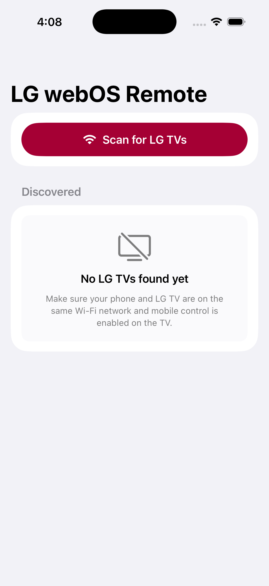
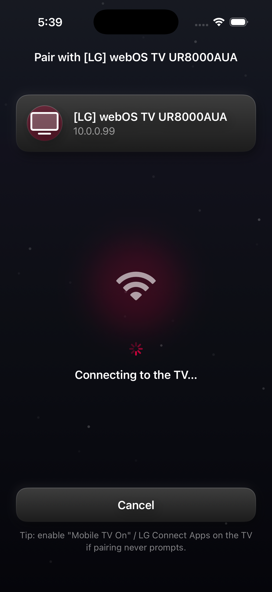
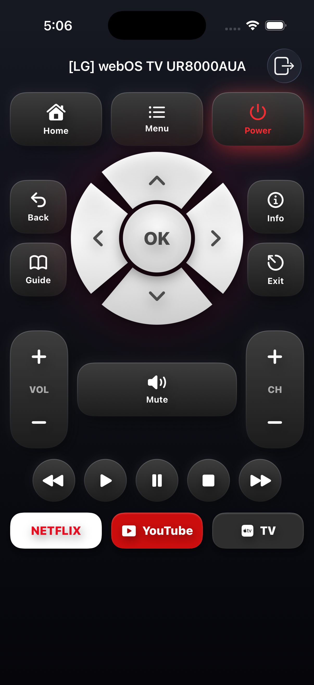

<p align="center">
  
</p>

# Universal TV Remote (iOS / SwiftUI)

A native **SwiftUI** iOS app that discovers **smart TVs** on your local Wi-Fi
network across multiple brands, pairs with them, and gives you a polished
on-screen remote — no backend, no vendor cloud.

> Started as a native-Swift port of the Flutter project
> [`TVRemoteProject`](https://github.com/SamEhr44/TVRemoteProject) (LG webOS) and
> grew into a brand-agnostic universal remote. Built to run in the **iOS
> Simulator** in Xcode and on a physical iPhone.

## Supported TVs

Control is **network-based** (Wi-Fi/LAN) — iPhones have no IR blaster, so this
works with smart TVs, not legacy IR-only sets.

| Brand | Protocol | Pairing | Status |
|---|---|---|---|
| **LG webOS** | SSAP WebSocket | on-TV prompt | ✅ full |
| **Roku** (incl. TCL/Hisense Roku TVs) | ECP (HTTP) | none | ✅ full |
| **Samsung** (Tizen) | remote WebSocket | on-TV "Allow" + token | ✅ full |
| **Vizio** SmartCast | HTTPS REST | PIN shown on TV | ✅ core keys |
| **Android TV / Google TV** | Remote v2 (protobuf/TLS) | PIN | 🚧 detection only |

The app is built on a brand-agnostic `TVController` abstraction, so adding a
brand is a self-contained controller — the discovery, pairing UI, and remote
screen adapt automatically via per-brand capabilities.

<p align="center">
  
  &nbsp;
  
  &nbsp;
  
</p>

> ✅ Verified building and launching in the iOS Simulator (iPhone 17, Xcode 26).

---

## Overview

The app talks directly to the TV on your LAN:

1. **Discover** — sends SSDP/UPnP `M-SEARCH` multicasts and lists responding LG TVs.
2. **Pair** — opens a WebSocket to the TV (`ws://<ip>:3000`, falling back to
   `wss://<ip>:3001`), sends an SSAP `register` request, and waits for you to
   accept the prompt on the TV.
3. **Store** — saves the TV's `client-key` locally with `UserDefaults` so future
   connections skip the prompt.
4. **Control** — sends SSAP commands (volume, mute, toast, power) and routes
   directional/Home/Back/OK through LG's pointer input socket.

## Features

- 🔎 Auto-discovery of LG webOS TVs via SSDP/UPnP multicast
- 📺 Device list with name, IP, and (when available) the device-description URL
- 🔌 WebSocket connect with `ws://:3000` → `wss://:3001` fallback
- 🤝 Pairing with on-screen approval instructions + retry/cancel
- 💾 Client-key persistence and silent reconnect
- 🎛️ Remote screen: Power Off, Home, Back, D-pad, OK, Volume ±, Mute, Toast test
- ⚡ Power **on** via Wake-on-LAN (learns the TV's MAC while connected)
- ⚠️ Clear, non-silent error reporting throughout the UI

## Project Structure

```
UniversalTVRemote/
  UniversalTVRemoteApp.swift        # App entry; launches the scan screen
  Models/
    TVDevice.swift                  # TV model + Codable (de)serialization
  Services/
    SSDPDiscoveryService.swift      # SSDP/UPnP M-SEARCH discovery (UDP)
    LGWebOSService.swift            # SSAP WebSocket: connect/register/commands
    WakeOnLanService.swift          # Wake-on-LAN magic-packet sender
    PairedTVStore.swift             # UserDefaults storage of paired TVs
  Views/
    ScanView.swift                  # Discover + list TVs
    PairingView.swift               # Connect, register, show prompt
    RemoteView.swift                # The working remote
    RemoteButton.swift              # Reusable remote button
```

## Requirements

- **macOS** with **Xcode 17** (or newer)
- iOS 17.0+ deployment target
- An **LG webOS TV** on the same Wi-Fi network (for real control)

## Build & Run (Xcode Simulator)

```bash
git clone https://github.com/SamEhr44/UniversalTVRemote-iOS.git
cd UniversalTVRemote-iOS
open UniversalTVRemote.xcodeproj
```

Then in Xcode pick an **iPhone simulator** and press **▶ Run**.

> **Simulator networking note:** the iOS Simulator shares the Mac's network
> stack, so SSDP discovery and TV control work against a real LG TV on the same
> network *without* the local-network permission prompt. On a physical device,
> iOS prompts for local network access on first launch — you must allow it.

### CLI build (optional)

```bash
xcodebuild -project UniversalTVRemote.xcodeproj \
  -scheme UniversalTVRemote \
  -destination 'platform=iOS Simulator,name=iPhone 17' build
```

## How Pairing Works

- The app connects and sends an SSAP `register` message including a permission
  manifest.
- The TV shows an **on-screen approval prompt**; the app displays
  *"Accept the pairing request on your LG TV."*
- When you accept, the TV returns a **`client-key`**, which the app stores.
- On later connections the stored key is sent in the `register` message, so the
  TV reconnects **without** prompting again.
- Directional buttons (Home/Back/arrows/OK) use LG's **pointer input socket**,
  obtained via `ssap://com.webos.service.networkinput/getPointerInputSocket`.

## Tech Stack

- **Swift / SwiftUI**
- **`TVController` abstraction** with per-brand controllers (LG/Roku/Samsung/Vizio)
- **POSIX UDP sockets** for SSDP discovery and Wake-on-LAN; **`NWBrowser`** for
  Bonjour/mDNS discovery (brand-classified)
- **`URLSessionWebSocketTask`** (LG SSAP, Samsung Tizen) and **`URLSession`**
  REST/HTTP (Roku ECP, Vizio SmartCast)
- **`UserDefaults`** for local storage of paired TVs / tokens
- No backend.

## License

Provided as-is for personal/educational use. LG and webOS are trademarks of
LG Electronics; this project is not affiliated with or endorsed by LG.
